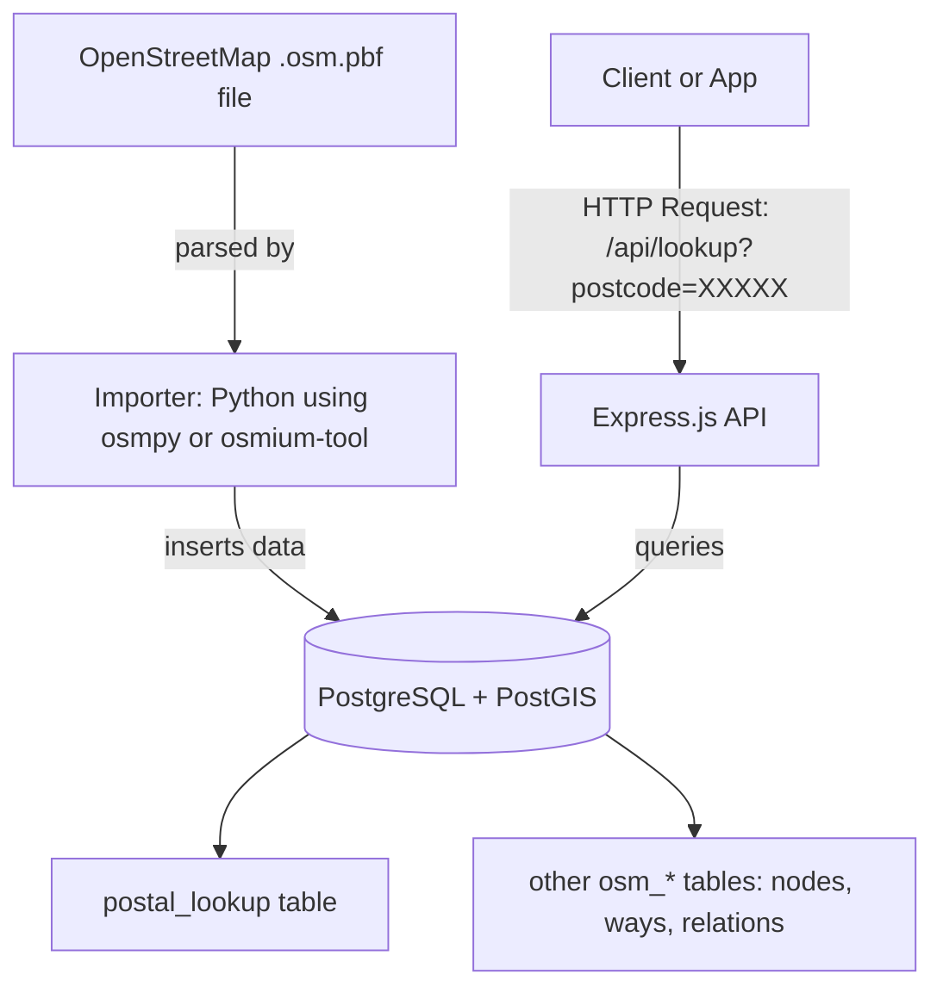

# 🗺️ OpenStreetMap Geocoding Service

A self-hosted geocoding stack built with **OpenStreetMap**, **PostgreSQL + PostGIS**, and **Node.js/Express**.  
It allows you to **convert postal codes → latitude/longitude**, and **query OSM nodes, ways, and relations** — without relying on external APIs.

---

## 🚀 Features

- Import `.osm.pbf` (OpenStreetMap data) into PostgreSQL
- Extract postal code coordinates into `postal_lookup`
- Store all other OSM entities (nodes, ways, relations) in dedicated tables
- Provide an API endpoint for postal code lookup
- Fully containerized via Docker Compose

---

## Architecture Overview




**Components:**
- **PostGIS DB:** Stores all parsed OSM data.
- **Importer:** Parses `.osm.pbf` and loads postal codes, nodes, ways, and relations.
- **API:** Serves postal lookup and object queries over HTTP.

---

## 🧱 Features

✅ Import `.osm.pbf` data from OpenStreetMap  
✅ Store geospatial data in PostgreSQL with PostGIS  
✅ Provide REST endpoints for:
  - Postal code lookup (`postal → lat/lon`)
  - Node, Way, and Relation queries  
✅ Modular Docker-based architecture  
✅ Extensible for future reverse geocoding  

---

## 📁 Directory Structure

```
osm-geocoder/
├── docker-compose.yml           # Orchestrates all services
├── db/
│   ├── init.sql                 # Creates schema and indexes
├── importer/
│   ├── Dockerfile               # Python + osmpy importer
│   ├── requirements.txt
│   └── import_osm.py
├── api/
│   ├── Dockerfile               # Node.js Express API
│   ├── package.json
│   ├── server.js
└── data/
    └── region-latest.osm.pbf    # Your OSM data file
```

---

## ⚙️ Setup & Installation

### 1. Download an OSM Extract
You can get region extracts from [Geofabrik](https://download.geofabrik.de/).

- [Planet OSM (planet-latest.osm.pbf, ~80 GB)](https://planet.openstreetmap.org/pbf/planet-latest.osm.pbf)
- [Brazil, ~1.8 GB](https://download.geofabrik.de/south-america/brazil-latest.osm.pbf)
- [Europe, ~31 GB](https://download.geofabrik.de/europe-latest.osm.pbf)
- [South America](https://download.geofabrik.de/south-america.html)
- [Europe](https://download.geofabrik.de/europe.html)
- [North America](https://download.geofabrik.de/north-america.html)
- [Australia & Oceania](https://download.geofabrik.de/australia-oceania.html)

Example (Brazil):
```bash
mkdir -p data
wget -O data/region-latest.osm.pbf https://download.geofabrik.de/south-america/brazil-latest.osm.pbf
```

---

### 2. Start the Stack
```bash
docker-compose up --build
```

🧩 Services launched:
| Service | Port | Description |
|----------|------|-------------|
| **db** | 5432 | PostgreSQL + PostGIS |
| **importer** | n/a | Imports `.osm.pbf` into database |
| **api** | 3000 | REST API service |

---

### 3. Wait for Import Completion
The importer will process the `.osm.pbf` file and populate:
- `postal_lookup` (postcode → lat/lon)
- `osm_nodes`
- `osm_ways`
- `osm_relations`

---

## 🔍 API Endpoints

Base URL: `http://localhost:3000`

| Method | Endpoint | Description |
|---------|-----------|-------------|
| **GET** | `/` | Health & info |
| **GET** | `/lookup?postal=XXXXX` | Lookup latitude/longitude by postal code |
| **GET** | `/node/:id` | Retrieve OSM node info |
| **GET** | `/way/:id` | Retrieve OSM way info |
| **GET** | `/relation/:id` | Retrieve OSM relation info |

### Example Queries
```bash
curl "http://localhost:3000/lookup?postal=12345"
curl "http://localhost:3000/node/1001"
```

---

## 🗃️ Database Schema

| Table | Purpose |
|--------|----------|
| **postal_lookup** | Stores postal codes with coordinates |
| **osm_nodes** | Individual map points (lat/lon + tags) |
| **osm_ways** | Linear or polygonal features (roads, areas, etc.) |
| **osm_relations** | Relationships between multiple OSM objects |

### Example Table: `postal_lookup`
```sql
CREATE TABLE postal_lookup (
  id SERIAL PRIMARY KEY,
  postcode VARCHAR,
  lat DOUBLE PRECISION,
  lon DOUBLE PRECISION
);

CREATE INDEX idx_postal ON postal_lookup(postcode);
```

---

## 🔧 Environment Variables

| Variable | Default | Description |
|-----------|----------|-------------|
| `DB_HOST` | `db` | PostgreSQL hostname |
| `DB_PORT` | `5432` | PostgreSQL port |
| `DB_USER` | `osmuser` | DB username |
| `DB_PASS` | `osmpass` | DB password |
| `DB_NAME` | `osm` | Database name |

---

## 🧩 Future Enhancements

🚀 Add reverse geocoding (`lat/lon → postal code`) using `ST_Distance` from PostGIS  
🗺️ Add `/nearby?lat=&lon=` for nearest nodes or POIs  
📦 Add caching layer (Redis)  
📘 Add Swagger/OpenAPI docs for API  

---

## 📚 References

- [OpenStreetMap Data Model](https://wiki.openstreetmap.org/wiki/OSM_XML)
- [PostGIS Documentation](https://postgis.net/documentation/)
- [osmpy Package](https://pypi.org/project/osmpy/)
- [osmium-tool](https://osmcode.org/osmium-tool/)
- [Geofabrik Extracts](https://download.geofabrik.de/)

---

## 🧑‍💻 Message from Author

Feel free to fork, extend, and integrate with your mapping or analytics solutions.
